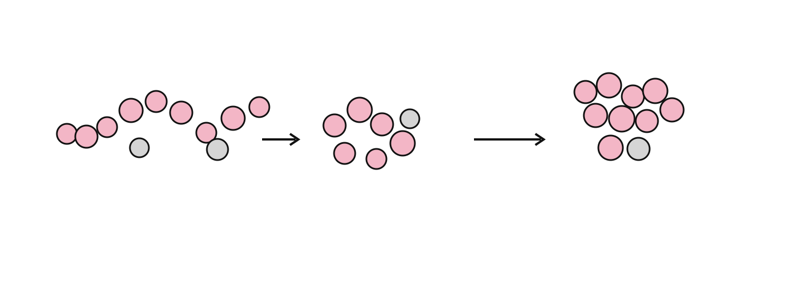

<p align="center">
  
</p>

<h1 align="center">ms-pcff2lammps</h1>

<p align="center">
A strict and auditable PCFF → LAMMPS Class-II conversion toolkit.
</p>

<p align="center">
  <code>Materials Studio</code> → <code>PCFF</code> → <code>LAMMPS</code>
</p>

---

## Overview

`ms-pcff2lammps` converts Materials Studio structures and user-supplied PCFF parameter data into LAMMPS-compatible Class-II bonded topology.

The design goal is simple:

**resolve → audit → translate → verify**

No hidden parameter guessing. No silent replacement. No bundled commercial force-field data.

---

## Pipeline

```

  CAR / MDF
      │
      ▼
  Topology extraction
      │
      ├──────────────┐
      ▼              ▼
 PCFF OFF       Parameter audit
      │              │
      └───────┬──────┘
              ▼
       Class-II conversion
              │
              ▼
        LAMMPS data
              │
              ▼
       parity validation

```

---

## Features

- PCFF/Class-II bonded parameter resolution
- Explicit parameter provenance tracking
- Fail-closed conversion workflow
- LAMMPS Class-II ordering conversion
- Fixed-coordinate energy parity validation

---

## Quick start

### Install

```bash
git clone https://github.com/Zarathustraaaa/ms-pcff2lammps.git
cd ms-pcff2lammps
python -m pip install .
```

### Audit

```bash
ms-pcff2lammps audit \
  --car system.car \
  --mdf system.mdf \
  --off /path/to/pcff.off
```

### Convert

```bash
ms-pcff2lammps generate \
  --car system.car \
  --mdf system.mdf \
  --off /path/to/pcff.off
```

---

## Validation

Current validated profile:

```
PAAm pentamer
fixed geometry workflow
```

Validation includes:

- parameter resolution checks
- Class-II topology checks
- bonded energy comparison

See:

- `docs/VALIDATION.md`
- `docs/LIMITATIONS.md`

---

## Scope

This project intentionally does not provide:

- Materials Studio files
- PCFF databases
- production nonbonded force-field setup
- universal validation for every chemistry

Users must provide their own licensed force-field resources.

---

## Development

```bash
python -m pip install -e '.[dev]'
pytest -q
```

---

## License

BSD 3-Clause License.

This software is independent research software and is not affiliated with Dassault Systèmes BIOVIA or the LAMMPS project.

<div align="center">

[Documentation](docs/USAGE.md) · [Validation](docs/VALIDATION.md) · [Issues](https://github.com/Zarathustraaaa/ms-pcff2lammps/issues)

</div>
