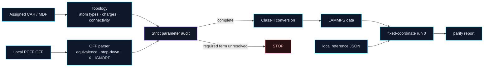
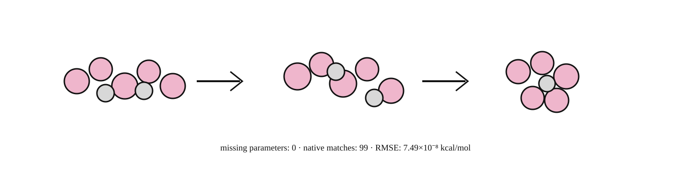

<p align="center">
  
</p>

<p align="center">
  <a href="https://github.com/Zarathustraaaa/ms-pcff2lammps/releases"></a>
  <a href="https://github.com/Zarathustraaaa/ms-pcff2lammps/actions/workflows/ci.yml"></a>
  
  
  
</p>

<p align="center">
  <strong>Strict parameter resolution · Class-II translation · fixed-geometry parity</strong>
</p>

<p align="center">
  <a href="#quick-start">Quick start</a> ·
  <a href="#conversion-pipeline">Pipeline</a> ·
  <a href="#validation">Validation</a> ·
  <a href="#scope-and-limitations">Limitations</a> ·
  <a href="https://github.com/Zarathustraaaa/ms-pcff2lammps/releases/tag/v0.1.0b1">v0.1.0b1</a>
</p>

---

## At a glance

<table>
<tr>
<td width="33%" valign="top">

### Audit

Resolve assigned topology against the local PCFF OFF hierarchy and write a machine-readable parameter audit.

**Default:** unresolved required terms stop the conversion.

</td>
<td width="33%" valign="top">

### Translate

Convert supported PCFF/Class-II bonded forms and cross terms into LAMMPS-compatible ordering.

**No fitting:** source coefficients remain traceable to resolved records.

</td>
<td width="33%" valign="top">

### Verify

Optionally run a fixed-coordinate LAMMPS `run 0` and compare definitionally equivalent bonded energy groups.

**Reference:** supplied locally by the user.

</td>
</tr>
</table>

| Contract | Current beta |
|---|---|
| **Input** | Materials Studio `.car` + `.mdf` + user-supplied PCFF `.off` |
| **Output** | Audited LAMMPS Class-II bonded topology and coefficients |
| **Failure policy** | Fail closed on unresolved required terms |
| **Production nonbonded setup** | Not generated |
| **Redistributed force-field data** | None |
| **Validated profile** | PAAm pentamer fixed-geometry workflow |

> [!IMPORTANT]
> This repository contains conversion code and redistributable validation metadata only. Materials Studio/PCFF parameter databases and private validation structures are not bundled.

## Why this exists

PCFF is a Class-II force field. A correct transfer requires more than copying diagonal bond, angle, torsion, and inversion coefficients. It also depends on equivalence rules, explicit wildcard records, bond-order step-down rules, cross terms, topology ordering, and LAMMPS-specific Class-II conventions.

`ms-pcff2lammps` keeps that process explicit and auditable. It does **not** retype atoms, invent charges, silently fill missing coefficients, or treat a successful file conversion as proof that a new chemistry has been validated.

## Conversion pipeline



The lookup and conversion path is deliberately fail-closed:

1. read the assigned CAR/MDF structure without retyping atoms or guessing bonds;
2. parse the user-supplied OFF database;
3. resolve each required interaction through the implemented OFF hierarchy;
4. write a machine-readable audit trail;
5. stop if a required interaction is unresolved;
6. emit LAMMPS Class-II bonded data only after the audit passes;
7. optionally run a fixed-coordinate bonded parity check.

## Quick start

Python 3.10 or newer is required.

Install the current beta directly from the tagged release:

```bash
python -m pip install \
  https://github.com/Zarathustraaaa/ms-pcff2lammps/releases/download/v0.1.0b1/ms_pcff2lammps-0.1.0b1-py3-none-any.whl
```

Or install from a source checkout:

```bash
git clone https://github.com/Zarathustraaaa/ms-pcff2lammps.git
cd ms-pcff2lammps
python -m pip install .
```

Check the CLI:

```bash
ms-pcff2lammps --version
ms-pcff2lammps --help
```

### 1. Audit first

```bash
ms-pcff2lammps audit \
  --car system.car \
  --mdf system.mdf \
  --off /path/to/pcff.off \
  --outdir audit
```

The primary output is `parameter_audit.csv`. Missing diagonal terms and unresolved Class-II cross terms remain errors.

### 2. Generate bonded Class-II data

```bash
ms-pcff2lammps generate \
  --car system.car \
  --mdf system.mdf \
  --off /path/to/pcff.off \
  --outdir converted
```

The generated LAMMPS input is a **fixed-coordinate bonded audit input** using `pair_style zero`. It is not a production MD template.

### 3. Optional LAMMPS parity run

```bash
ms-pcff2lammps generate \
  --car system.car \
  --mdf system.mdf \
  --off /path/to/pcff.off \
  --outdir converted \
  --lammps /path/to/lmp
```

Without a reference, the tool reports bonded thermo components but does not declare parity.

## Reference-based parity

Reference energies are supplied locally and are never embedded or selected implicitly.

```json
{
  "label": "fixed-geometry Forcite reference",
  "tolerance_kcal_mol": 0.001,
  "ebond": 1.234,
  "eangle": 2.345,
  "edihed": -0.456,
  "eimp": 0.012
}
```

```bash
ms-pcff2lammps generate \
  --car system.car \
  --mdf system.mdf \
  --off /path/to/pcff.off \
  --reference-json reference.json \
  --lammps /path/to/lmp
```

Only like-for-like bonded groups should be compared. Materials Studio and LAMMPS do not necessarily expose identical component labels.

## Validation

The most complete validation in the current beta is a fixed-coordinate PAAm pentamer workflow.

<p align="center">
  
</p>

| Metric | Result |
|---|---:|
| Required missing parameters | **0** |
| Unexpected Bend-Bend missing components | **0** |
| AngleAngle topologies | **40** |
| Native Bend-Bend exact matches | **99** |
| Native symmetry-resolved components | **9** |
| Validated Bend-Bend no-op components | **12** |
| BASE improper + AngleAngle delta | **3.787 × 10⁻¹² kcal/mol** |
| C1_C9_plus improper + AngleAngle delta | **3.786 × 10⁻¹² kcal/mol** |
| Relative total-energy RMSE | **7.486 × 10⁻⁸ kcal/mol** |
| Relative total-energy max residual | **1.113 × 10⁻⁷ kcal/mol** |

The associated nonbonded parity run used:

```text
pair_style lj/class2/coul/cut 12.5
special_bonds lj/coul 0.0 0.0 1.0
```

Nonbonded pair coefficients and the direct-cutoff validation were handled separately. `0.1.0b1` does not generate a production nonbonded input.

See [docs/VALIDATION.md](docs/VALIDATION.md) and [docs/NONBONDED.md](docs/NONBONDED.md) for the full record.

<details>
<summary><strong>PAAm Bend-Bend validation profile</strong></summary>

The release includes one named profile, `paam-pentamer-20260917`, for the PAAm pentamer workflow used to establish the current native Bend-Bend/AngleAngle mapping.

Reproducing that path requires a local native Bend-Bend export from Materials Studio; the export is not distributed here.

```bash
ms-pcff2lammps generate \
  --car PAAm.car \
  --mdf PAAm.mdf \
  --off /path/to/pcff.off \
  --native-bendbend /path/to/pcff_native_bendbend.csv \
  --bendbend-profile paam-pentamer-20260917 \
  --forcite-missing-parameters 0 \
  --allow-forcite-cross-zero \
  --reference-json /path/to/paam_bonded_reference.json \
  --lammps /path/to/lmp
```

The profile is deliberately named and gated. It is not a transferable claim for every PCFF atom type or chemistry.

</details>

## Scope and limitations

This project is intentionally conservative.

- Native Bend-Bend support is validated only for the named PAAm profile.
- The built-in atomic mass table currently covers H, C, N, and O.
- Production nonbonded setup is outside the scope of this beta.
- Some Class-II cross-term applicability logic was developed against the PAAm validation case and requires independent validation on new chemistry.
- A successful parameter audit is not a substitute for energy/force parity on the target system.
- A Forcite `BendBendEnergy` value must not be compared directly with LAMMPS `eimp` when the latter also contains ordinary inversion energy.

See [docs/LIMITATIONS.md](docs/LIMITATIONS.md) before applying the converter to a new system.

## Design principles

- **Assigned topology is authoritative.** Connectivity and atom typing come from the Materials Studio files; the converter does not infer a replacement model from geometry.
- **Parameter provenance stays visible.** Matching level, source record, coefficient values, zero/no-op source, and status are written into the audit path.
- **Missing is not zero.** A lookup failure is treated as an implementation or coverage problem unless an explicitly validated profile says otherwise.
- **Parity is definition-aware.** Energy components are compared only when the source and LAMMPS quantities represent the same terms.
- **Private data stays private.** Public CI is synthetic and self-contained; commercial parameter databases and project structures remain local.

## Development

```bash
python -m pip install -e '.[dev]'
python -m compileall -q src tests
pytest -q tests
python scripts/check_repository_hygiene.py
```

Public CI is self-contained. It does not require Materials Studio, a PCFF database, LAMMPS, native parameter exports, or project-specific validation structures.

## Documentation

| Document | Purpose |
|---|---|
| [Usage](docs/USAGE.md) | Commands, audit semantics, and common workflows |
| [Algorithm](docs/ALGORITHM.md) | Lookup order and Class-II conversion logic |
| [Validation](docs/VALIDATION.md) | Numerical validation record |
| [Testing](docs/TESTING.md) | Public CI and validation strategy |
| [Nonbonded notes](docs/NONBONDED.md) | Nonbonded parity details |
| [Parameter data](docs/PARAMETER_DATA.md) | Data and licensing boundary |
| [Provenance](docs/PROVENANCE.md) | Project provenance and release preparation |
| [Limitations](docs/LIMITATIONS.md) | Supported scope and known limitations |
| [Release process](docs/RELEASING.md) | Release checklist and package verification |
| [Disclaimer](DISCLAIMER.md) | Scientific and legal scope |

## License and independence

The source code is released under the [BSD 3-Clause License](LICENSE). That license applies only to this project's code and does not grant rights to Materials Studio, PCFF parameter databases, or any third-party software or data.

This is independent research software. It is not affiliated with, endorsed by, or sponsored by Dassault Systèmes BIOVIA or the LAMMPS project. Product and project names are used only to describe interoperability.

---

<div align="center">

**[v0.1.0b1 release](https://github.com/Zarathustraaaa/ms-pcff2lammps/releases/tag/v0.1.0b1)** · **[Documentation](docs/USAGE.md)** · **[Report an issue](https://github.com/Zarathustraaaa/ms-pcff2lammps/issues)**

</div>
